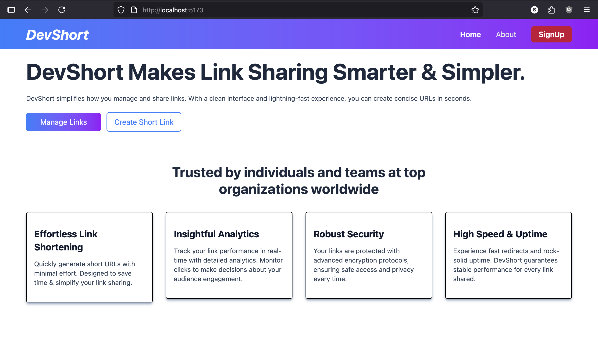
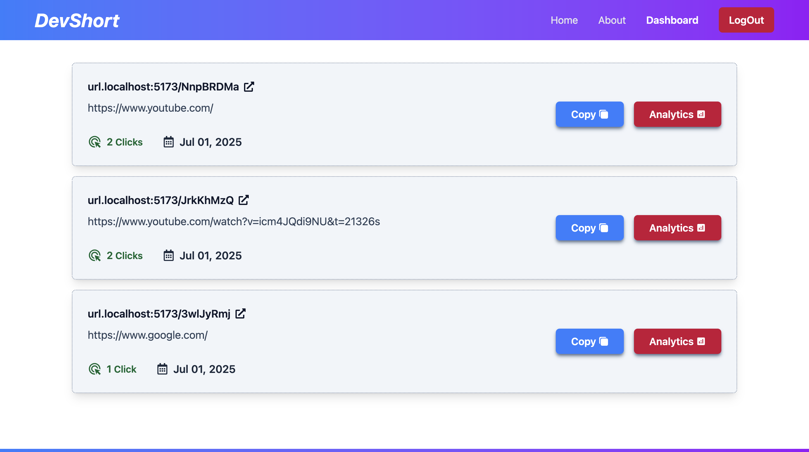
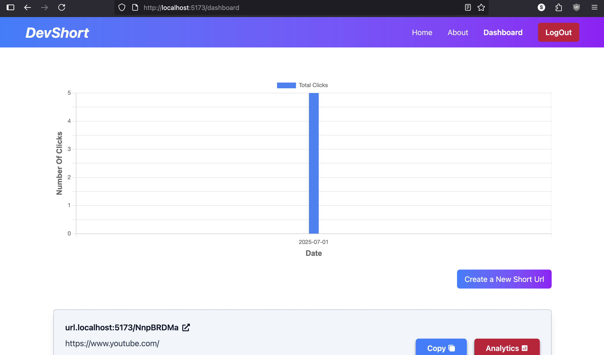
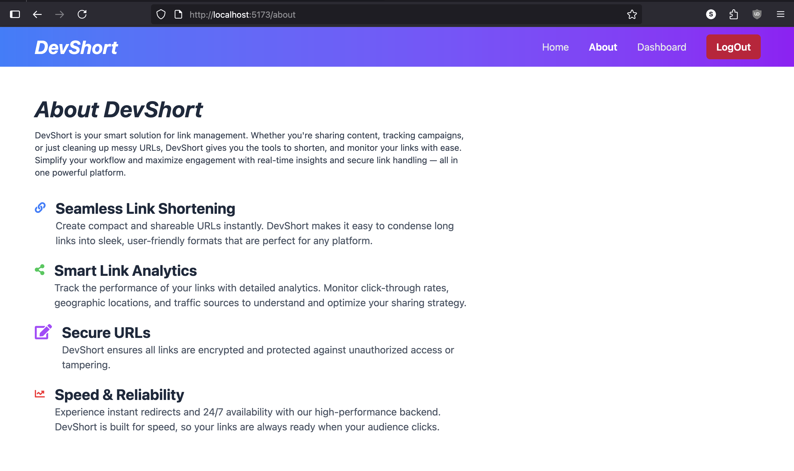

# DevShort - Smarter & Simpler Link Sharing

**DevShort** simplifies how you manage and share links. With a clean interface and lightning-fast performance, you can create concise, secure URLs in seconds.

---

## 📸 Screenshots

### 🔗 Home Page

 

### 🔗 Dashboard

 

 

### 🔗 About

 
---

## 🚀 Features

- 🔗 **Effortless Link Shortening**
- 📈 **Insightful Analytics**
- 🔐 **Robust Security**
- ⚡ **High Speed & Uptime**

---

## 🛠️ Tech Stack

### 🔧 Backend
- **Spring Boot**
- **Spring Security** (JWT)
- **Hibernate & JPA**
- **MySQL / PostgreSQL**

### 🎨 Frontend
- **React (Vite)**
- **Tailwind CSS**
- **Axios**
- **React Router DOM**

---

